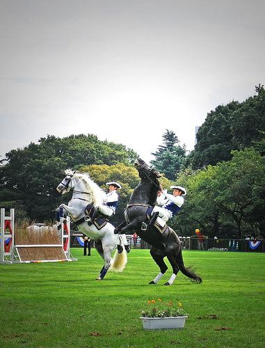

# Apply data augmentation on YOLOv5 or YOLOv8 dataset using Albumentations Library
Albumentations is a Python library for image augmentation that offers a simple and flexible way to perform a variety of image transformations.

## Input 

## Output

## Output Visualization


## Directories description
- **input-ds** contain the input of YOLOv8 and YOLOv5 which are following directories.
    - Images directory contains the images
    - labels directory contains the .txt files. Each .txt file contains the normalized bounding boxes in a following format.
- **out-aug-ds** contain the augmented output contains following directories.
    - Images directory contains the augmented images.
    - labels directory contains the augmented labels.
- **utils.py**: Contains all user-defined helper function
- **main.py**: Contains Yolo dataset augmentor pipeline
- **CONSTANT.yaml** contain following contants need to update on according to your case.
    - inp_img_pth for input images path
    - inp_lab_pth for input labels path
    - out_img_pth for output image path
    - out_lab_pth for output labels path
    - transformed_file_name: use to name augmented output to differentiate from other input dataset.
    - CLASSES: list of input class name according to class number. 
## Usage
- step to apply augmentation on your own dataset.
    - Create Virtual Environment.
    - Install requirements using 
        ```
        pip install -r requirements.txt
        ```
    - Provide the input and output path in **CONSTANT.yaml** file.
    - Update the name of transformed_file_name in CONSTANT.yaml otherwise code will overwrite last augmentations.
    - Provide the list of classes in CONSTANT.yaml in a sequence as use to assign class number in yolo dataset labelling. 
        - For example, you provided class list is ```['obj1', 'obj2', 'obj3']``` class number used for obj1 in label file should be 0, similarly for 'obj2' class number should be 1 and so on.
    - Run the pipeline using 
        ```
        python3 run.py
        ```